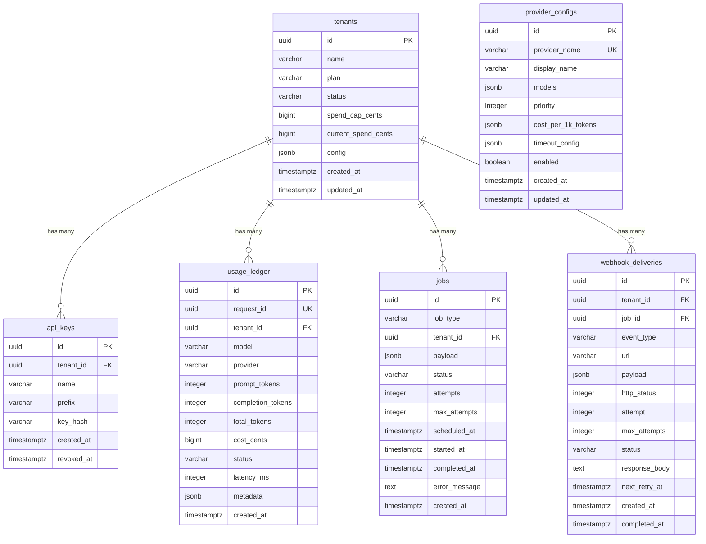

# 03 — Data Model

> PostgreSQL schema, indexes, migration strategy, and Redis key design for InfrGate.

| Attribute | Value |
|---|---|
| **Status** | Final |
| **Phases** | All (1–5) |
| **Audience** | All contributors |

---

## 1. Overview

PostgreSQL is the **system of record** for all durable state. Redis holds ephemeral state only (rate limits, circuit breaker, health signals). If Redis is lost, the system loses rate limit counters but never loses usage data or tenant records.

### Table introduction schedule

| Table | Phase | Purpose |
|---|---|---|
| `tenants` | 1 | Multi-tenant identity, plan, spend cap, status |
| `api_keys` | 1 | Prefix + hash key storage, revocation |
| `usage_ledger` | 1 | One row per inference; `UNIQUE(request_id)` |
| `provider_configs` | 2 | Provider/model config, priority, costs, timeouts |
| `jobs` | 3 | Postgres-backed worker queue |
| `webhook_deliveries` | 3 | Webhook attempt tracking and retries |

---

## 2. Entity-Relationship diagram



---

## 3. Table schemas

### 3.1 `tenants` `[Phase 1]`

```sql
CREATE TABLE tenants (
    id              UUID PRIMARY KEY DEFAULT gen_random_uuid(),
    name            VARCHAR(255) NOT NULL,
    plan            VARCHAR(50)  NOT NULL DEFAULT 'free',
    status          VARCHAR(20)  NOT NULL DEFAULT 'active',
    spend_cap_cents BIGINT,                                     -- NULL = unlimited
    current_spend_cents BIGINT   NOT NULL DEFAULT 0,
    config          JSONB        NOT NULL DEFAULT '{}',
    created_at      TIMESTAMPTZ  NOT NULL DEFAULT now(),
    updated_at      TIMESTAMPTZ  NOT NULL DEFAULT now(),

    CONSTRAINT chk_tenant_plan   CHECK (plan IN ('free', 'standard', 'enterprise')),
    CONSTRAINT chk_tenant_status CHECK (status IN ('active', 'suspended'))
);

CREATE INDEX idx_tenants_status ON tenants (status);
CREATE INDEX idx_tenants_plan   ON tenants (plan);
```

**`config` JSONB structure:**

```json
{
  "allowed_models": ["gemini-2.0-flash", "gemini-2.5-pro"],
  "rpm_limit": 60,
  "tpm_limit": 100000
}
```

| Field | Type | Default | Description |
|---|---|---|---|
| `allowed_models` | `string[]` | All models | Models this tenant can access |
| `rpm_limit` | `integer` | Plan default | Requests per minute override |
| `tpm_limit` | `integer` | Plan default | Tokens per minute override |

**Plan defaults:**

| Plan | RPM | TPM | Spend Cap |
|---|---|---|---|
| `free` | 10 | 10,000 | $10 |
| `standard` | 60 | 100,000 | $100 |
| `enterprise` | 600 | 1,000,000 | Unlimited |

---

### 3.2 `api_keys` `[Phase 1]`

```sql
CREATE TABLE api_keys (
    id          UUID PRIMARY KEY DEFAULT gen_random_uuid(),
    tenant_id   UUID         NOT NULL REFERENCES tenants(id) ON DELETE CASCADE,
    name        VARCHAR(255) NOT NULL DEFAULT '',
    prefix      VARCHAR(20)  NOT NULL,                          -- e.g. "sk-infr_abc12345"
    key_hash    VARCHAR(64)  NOT NULL,                          -- SHA-256 hex digest
    created_at  TIMESTAMPTZ  NOT NULL DEFAULT now(),
    revoked_at  TIMESTAMPTZ,                                    -- NULL = active

    CONSTRAINT uq_api_keys_prefix UNIQUE (prefix)
);

CREATE INDEX idx_api_keys_tenant  ON api_keys (tenant_id);
CREATE INDEX idx_api_keys_prefix  ON api_keys (prefix) WHERE revoked_at IS NULL;
```

**Key format:** `sk-infr_<8-char-prefix>.<32-char-secret>`

**Authentication flow:**
1. Extract prefix from the API key (everything before the `.`)
2. Look up `api_keys` row by prefix (using partial index for active keys)
3. Hash the full key with SHA-256
4. Compare hash with stored `key_hash`
5. If match, load the associated tenant

See [04-authentication-tenancy.md](04-authentication-tenancy.md) for the full flow.

---

### 3.3 `usage_ledger` `[Phase 1]`

```sql
CREATE TABLE usage_ledger (
    id                UUID PRIMARY KEY DEFAULT gen_random_uuid(),
    request_id        UUID         NOT NULL,
    tenant_id         UUID         NOT NULL REFERENCES tenants(id),
    model             VARCHAR(100) NOT NULL,
    provider          VARCHAR(50)  NOT NULL,
    prompt_tokens     INTEGER      NOT NULL DEFAULT 0,
    completion_tokens INTEGER      NOT NULL DEFAULT 0,
    total_tokens      INTEGER      NOT NULL DEFAULT 0,
    cost_cents        BIGINT       NOT NULL DEFAULT 0,
    status            VARCHAR(20)  NOT NULL DEFAULT 'completed',
    latency_ms        INTEGER,
    metadata          JSONB        NOT NULL DEFAULT '{}',
    created_at        TIMESTAMPTZ  NOT NULL DEFAULT now(),

    CONSTRAINT uq_usage_request_id UNIQUE (request_id),
    CONSTRAINT chk_usage_status    CHECK (status IN ('completed', 'failed', 'partial'))
);

CREATE INDEX idx_usage_tenant_created ON usage_ledger (tenant_id, created_at DESC);
CREATE INDEX idx_usage_model          ON usage_ledger (model);
CREATE INDEX idx_usage_created        ON usage_ledger (created_at DESC);
```

**Idempotency:** The `UNIQUE(request_id)` constraint ensures that a usage record is written at most once per inference request. On conflict, the gateway performs an `ON CONFLICT (request_id) DO NOTHING`.

**`metadata` JSONB structure:**

```json
{
  "routing_decision": "priority",
  "retry_count": 0,
  "failover_from": null,
  "client_disconnected": false,
  "finish_reason": "stop"
}
```

---

### 3.4 `provider_configs` `[Phase 2]`

```sql
CREATE TABLE provider_configs (
    id                UUID PRIMARY KEY DEFAULT gen_random_uuid(),
    provider_name     VARCHAR(50)  NOT NULL,
    display_name      VARCHAR(100) NOT NULL,
    models            JSONB        NOT NULL DEFAULT '[]',
    priority          INTEGER      NOT NULL DEFAULT 100,         -- lower = higher priority
    cost_per_1k_tokens JSONB       NOT NULL DEFAULT '{}',
    timeout_config    JSONB        NOT NULL DEFAULT '{}',
    enabled           BOOLEAN      NOT NULL DEFAULT true,
    created_at        TIMESTAMPTZ  NOT NULL DEFAULT now(),
    updated_at        TIMESTAMPTZ  NOT NULL DEFAULT now(),

    CONSTRAINT uq_provider_name UNIQUE (provider_name)
);
```

**`models` JSONB:**

```json
[
  {
    "model_id": "gemini-2.0-flash",
    "aliases": ["gemini-flash"],
    "capabilities": ["chat"],
    "max_context_tokens": 1048576
  }
]
```

**`cost_per_1k_tokens` JSONB:**

```json
{
  "gemini-2.0-flash": { "prompt": 0.10, "completion": 0.40 },
  "gemini-2.5-pro":   { "prompt": 1.25, "completion": 10.0 }
}
```

**`timeout_config` JSONB:**

```json
{
  "connect_timeout_s": 5,
  "read_timeout_s": 30,
  "total_timeout_s": 60
}
```

---

### 3.5 `jobs` `[Phase 3]`

```sql
CREATE TABLE jobs (
    id            UUID PRIMARY KEY DEFAULT gen_random_uuid(),
    job_type      VARCHAR(50)  NOT NULL,
    tenant_id     UUID         REFERENCES tenants(id),
    payload       JSONB        NOT NULL DEFAULT '{}',
    status        VARCHAR(20)  NOT NULL DEFAULT 'pending',
    attempts      INTEGER      NOT NULL DEFAULT 0,
    max_attempts  INTEGER      NOT NULL DEFAULT 3,
    scheduled_at  TIMESTAMPTZ  NOT NULL DEFAULT now(),
    started_at    TIMESTAMPTZ,
    completed_at  TIMESTAMPTZ,
    error_message TEXT,
    created_at    TIMESTAMPTZ  NOT NULL DEFAULT now(),

    CONSTRAINT chk_job_status CHECK (status IN ('pending', 'running', 'completed', 'failed', 'dead_letter')),
    CONSTRAINT chk_job_type   CHECK (job_type IN ('usage_aggregation', 'webhook_delivery', 'spend_alert'))
);

CREATE INDEX idx_jobs_dequeue ON jobs (scheduled_at)
    WHERE status = 'pending';
CREATE INDEX idx_jobs_tenant  ON jobs (tenant_id);
CREATE INDEX idx_jobs_status  ON jobs (status);
```

**Dequeue pattern** (`FOR UPDATE SKIP LOCKED`):

```sql
UPDATE jobs
SET    status = 'running', started_at = now(), attempts = attempts + 1
WHERE  id = (
    SELECT id FROM jobs
    WHERE  status = 'pending'
      AND  scheduled_at <= now()
    ORDER BY scheduled_at
    LIMIT 1
    FOR UPDATE SKIP LOCKED
)
RETURNING *;
```

See [11-background-worker.md](11-background-worker.md) for the full worker lifecycle.

---

### 3.6 `webhook_deliveries` `[Phase 3]`

```sql
CREATE TABLE webhook_deliveries (
    id             UUID PRIMARY KEY DEFAULT gen_random_uuid(),
    tenant_id      UUID         NOT NULL REFERENCES tenants(id),
    job_id         UUID         REFERENCES jobs(id),
    event_type     VARCHAR(50)  NOT NULL,
    url            TEXT         NOT NULL,
    payload        JSONB        NOT NULL,
    http_status    INTEGER,
    attempt        INTEGER      NOT NULL DEFAULT 1,
    max_attempts   INTEGER      NOT NULL DEFAULT 5,
    status         VARCHAR(20)  NOT NULL DEFAULT 'pending',
    response_body  TEXT,
    next_retry_at  TIMESTAMPTZ,
    created_at     TIMESTAMPTZ  NOT NULL DEFAULT now(),
    completed_at   TIMESTAMPTZ,

    CONSTRAINT chk_delivery_status CHECK (status IN ('pending', 'success', 'failed', 'dead_letter')),
    CONSTRAINT chk_event_type      CHECK (event_type IN ('spend_threshold', 'usage_summary'))
);

CREATE INDEX idx_deliveries_tenant ON webhook_deliveries (tenant_id);
CREATE INDEX idx_deliveries_retry  ON webhook_deliveries (next_retry_at)
    WHERE status = 'pending';
```

---

## 4. Migration strategy

### 4.1 Alembic conventions

- **One migration per logical change** (never bundle unrelated schema changes)
- **Naming:** `YYYYMMDD_HHMM_description.py` (e.g., `20260115_1030_create_tenants.py`)
- **Direction:** Every migration has both `upgrade()` and `downgrade()` functions
- **Safety:** All migrations must be safe to run on a database with active connections
  - Use `CREATE INDEX CONCURRENTLY` for large tables
  - Never `DROP COLUMN` without a prior deprecation migration
  - Use `ADD COLUMN ... DEFAULT ...` to avoid full table rewrites on Postgres 11+

### 4.2 Migration sequence

| Order | Migration | Phase | Description |
|---|---|---|---|
| 1 | `create_tenants` | 1 | Create `tenants` table |
| 2 | `create_api_keys` | 1 | Create `api_keys` table with FK to tenants |
| 3 | `create_usage_ledger` | 1 | Create `usage_ledger` table |
| 4 | `create_provider_configs` | 2 | Create `provider_configs` table |
| 5 | `seed_provider_configs` | 2 | Insert Gemini + OpenAI default configs |
| 6 | `create_jobs` | 3 | Create `jobs` table |
| 7 | `create_webhook_deliveries` | 3 | Create `webhook_deliveries` table |

### 4.3 Alembic project structure

```
alembic/
├── alembic.ini
├── env.py
├── script.py.mako
└── versions/
    ├── 20260115_1030_create_tenants.py
    ├── 20260115_1031_create_api_keys.py
    ├── 20260115_1032_create_usage_ledger.py
    └── ...
```

---

## 5. Redis key design

Redis holds **ephemeral state only**. All keys use the namespace prefix `infrgate:`.

### 5.1 Key namespace

| Key pattern | Type | TTL | Phase | Purpose |
|---|---|---|---|---|
| `infrgate:ratelimit:{tenant_id}:rpm:{window}` | `ZSET` | Window size + buffer | 1 | Sliding window RPM counter |
| `infrgate:ratelimit:{tenant_id}:tpm:{window}` | `ZSET` | Window size + buffer | 1 | Sliding window TPM counter |
| `infrgate:circuit:{provider_name}` | `HASH` | None (managed) | 2 | Circuit breaker state and counters |
| `infrgate:health:{provider_name}` | `HASH` | 5 min | 4 | EWMA health scores |
| `infrgate:health:{provider_name}:latency` | `LIST` | 10 min | 4 | Recent latency samples |
| `infrgate:health:{provider_name}:errors` | `LIST` | 10 min | 4 | Recent error samples |

### 5.2 Rate limit keys (detail) `[Phase 1]`

Using sorted sets for sliding window:

```
Key:    infrgate:ratelimit:{tenant_id}:rpm:{window_key}
Score:  Timestamp (Unix microseconds)
Member: Unique request identifier

TTL:    window_size_seconds + 10 (buffer)
```

See [05-rate-limiting.md](05-rate-limiting.md) for the full algorithm.

### 5.3 Circuit breaker keys (detail) `[Phase 2]`

```
Key: infrgate:circuit:{provider_name}
Type: HASH
Fields:
  state          → "closed" | "open" | "half_open"
  failure_count  → integer
  success_count  → integer (in half_open)
  last_failure   → Unix timestamp
  opened_at      → Unix timestamp (when state = open)
  half_open_at   → Unix timestamp (when state = half_open)
```

See [08-reliability.md](08-reliability.md) for the FSM transitions.

### 5.4 Health signal keys (detail) `[Phase 4]`

```
Key: infrgate:health:{provider_name}
Type: HASH
Fields:
  ewma_latency_ms    → float
  ewma_error_rate    → float (0.0–1.0)
  ewma_availability  → float (0.0–1.0)
  last_updated       → Unix timestamp
  sample_count       → integer
```

See [07-routing-engine.md](07-routing-engine.md) for the EWMA calculation.

---

## 6. Data lifecycle

### 6.1 Retention

| Data | Retention | Mechanism |
|---|---|---|
| `tenants` | Indefinite | Soft-delete via `status = 'suspended'` |
| `api_keys` | Indefinite | Soft-delete via `revoked_at` |
| `usage_ledger` | 90 days (configurable) | Background cleanup job `[Phase 3]` |
| `provider_configs` | Indefinite | Managed via admin API |
| `jobs` | 7 days after completion | Background cleanup job `[Phase 3]` |
| `webhook_deliveries` | 30 days | Background cleanup job `[Phase 3]` |
| Redis rate limit keys | Window TTL | Auto-expire |
| Redis circuit breaker | Managed | Reset on state transitions |
| Redis health signals | 5–10 min TTL | Auto-expire |

### 6.2 Backup strategy

- PostgreSQL: daily `pg_dump` with point-in-time recovery (WAL archiving) in production
- Redis: no backup needed (ephemeral by design; state is reconstructable)

---

## References

- [04-authentication-tenancy.md](04-authentication-tenancy.md) — API key schema details
- [05-rate-limiting.md](05-rate-limiting.md) — Redis rate limit algorithm
- [08-reliability.md](08-reliability.md) — Circuit breaker state machine
- [10-usage-accounting.md](10-usage-accounting.md) — Usage ledger semantics
- [11-background-worker.md](11-background-worker.md) — Job queue design
